# Routing finish guide: the last 50 connections, by interactive push-and-shove (2026-10-03)

This guide is for whoever finishes the routing in KiCad. Every number in it was measured on the handoff board
(`RFVD_SENSOR_BOARD.kicad_pcb`, sha256 `31e0108f2f…`, hand-edit step m16) with read-only tools. Nothing here was
auto-routed. Where a step is a plan rather than a measured fact, it says so.


> **Checkpoint 5 (2026-10-04), board sha256 `f9fb559366`: the finishing state for hand routing.**
> - DRC: **0 errors**, 110 warnings, sign-off PASS.
> - **42 open links, 0 blocked**: 12 direct, 30 with a mapped path (table below).
> - Every footprint is locked, so push-and-shove moves only tracks.
> - The 42 `via_dangling` warnings are hand-off escape vias placed for you: start each link from them.
> - Sections 2-5 still apply. The older per-package tables in §6 are kept for history; the generated table below is current.

## 0. Open links at cp5 (generated from feasible.py)

**42 open links: 12 direct, 30 routable with the path shown, 0 blocked.** Paths are legal free-space corridors found by `tools/feasible.py` against every DRU clearance, rule area and via ban. They are a guide for the interactive router, not finished geometry: route them octilinear with fillets on clocks and strobes, and add a GND return via at every layer change of a fast net (R17).

### Expansion / J11 (15 links)

| Net | Class / width | End A (pads, point) | End B (pads, point) | Gap mm | Verdict and suggested path |
|---|---|---|---|---|---|
| EXP_ANA_MON | Harness_IO 0.15 | D406.5 D406.6 J11.34 (144.08, 126.94) | R435.2 (139.51, 97.96) | 29.3 | ROUTE B >via (144.85, 125.38)> F >via (120.31, 110.43)> B (2 vias) |
| EXP_GATE | Harness_IO 0.15 | D403.1 J11.33 (144.00, 132.74) | R433.2 (139.28, 91.13) | 41.9 | ROUTE B >via (131.51, 140.38)> In3 >via (135.5, 96.41)> F >via (139.71, 92.47)> B (3 vias) |
| EXP_SPI_MOSI | HighSpeed_Digital 0.15 | D401.2 J11.7 (137.50, 132.74) | R421.2 (128.74, 92.14) | 41.5 | ROUTE B >via (137.65, 132.46)> F >via (120.29, 110.41)> In3 (2 vias) |
| EXP_SPI_SCK | HighSpeed_Clock 0.15 | D401.1 J11.5 (137.00, 132.74) | R419.2 (128.23, 91.13) | 42.5 | ROUTE B >via (136.54, 136.05)> F >via (130.89, 115.02)> In3 >via (128.58, 105.31)> F (3 vias) |
| EXP_SYNC | Harness_IO 0.15 | D403.2 D403.9 J11.35 R440.2 (144.50, 132.74) | R434.2 (137.33, 102.03) | 31.5 | ROUTE B >via (164.72, 136.05)> F >via (120.31, 110.43)> B (2 vias) |
| EXP_3V3_SNS | Default 0.1 | C408.1 R415.1 U8.18 (141.55, 93.97) | R414.2 (136.60, 136.83) | 43.1 | ROUTE F >via (136.51, 136.49)> B (1 vias) |
| EXP_CS0_N_MCU | HighSpeed_Digital 0.15 | U8.51 (127.68, 90.46) | R425.1 (137.40, 136.83) | 47.4 | ROUTE In3 >via (120.29, 110.41)> F (1 vias) |
| EXP_CS1_N_MCU | HighSpeed_Digital 0.15 | U8.55 (127.68, 92.46) | R427.1 (139.45, 136.83) | 45.9 | ROUTE In3 >via (120.29, 110.41)> F (1 vias) |
| EXP_DETECT_N_MCU | Harness_IO 0.15 | U8.90 (135.70, 104.79) | RN401.4 (142.10, 124.94) | 21.1 | DIRECT B.Cu, In3.Cu |
| EXP_INT1_N_MCU | Harness_IO 0.15 | U8.57 (129.16, 93.72) | RN401.1 (140.60, 124.94) | 33.2 | DIRECT In3.Cu |
| EXP_IO0_MCU | Harness_IO 0.15 | U8.98 (139.62, 105.67) | RN401.2 (140.84, 124.20) | 18.6 | DIRECT B.Cu, In3.Cu |
| EXP_IO1_MCU | Harness_IO 0.15 | U8.97 (139.17, 104.79) | RN401.3 (142.18, 124.23) | 19.7 | DIRECT In3.Cu |
| EXP_MISO_MCU | HighSpeed_Digital 0.15 | U8.53 (127.68, 91.46) | R423.1 (137.47, 137.83) | 47.4 | ROUTE In3 >via (120.29, 110.41)> F (1 vias) |
| EXP_RST_N_MCU | Harness_IO 0.15 | U8.91 (135.64, 105.56) | R431.1 (141.50, 136.82) | 31.8 | DIRECT In3.Cu |
| EXP_VHP_SNS | Default 0.1 | C407.1 R413.1 U8.17 (140.07, 94.70) | R412.2 (144.48, 137.78) | 43.3 | ROUTE F >via (152.53, 93.79)> B (1 vias) |

### LCD bus / J4 (14 links)

| Net | Class / width | End A (pads, point) | End B (pads, point) | Gap mm | Verdict and suggested path |
|---|---|---|---|---|---|
| LCD_BL_SW | Default 0.1 | D201.1 D202.1 Q203.3 (147.85, 117.22) | D203.1 D204.1 (133.10, 117.22) | 14.8 | ROUTE B >via (148.03, 117.86)> F (1 vias) |
| LCD_CS_N | Harness_IO 0.15 | C203.1 J4.10 (136.13, 122.92) | RN203.6 (135.15, 103.02) | 19.9 | DIRECT B.Cu, In3.Cu |
| LCD_D0 | HighSpeed_Digital 0.15 | J4.22 (140.93, 122.34) | RN201.8 (124.57, 96.52) | 30.6 | ROUTE B >via (130.86, 119.73)> In3 (1 vias) |
| LCD_D1 | HighSpeed_Digital 0.15 | J4.23 (142.53, 122.49) | RN201.7 (124.57, 95.97) | 32.0 | ROUTE B >via (130.86, 119.73)> In3 (1 vias) |
| LCD_D2 | HighSpeed_Digital 0.15 | J4.24 (143.13, 122.92) | RN203.5 (134.85, 101.09) | 23.4 | DIRECT B.Cu |
| LCD_D3 | HighSpeed_Digital 0.15 | J4.25 (143.63, 122.92) | RN203.7 (134.85, 102.04) | 22.6 | ROUTE F >via (146.01, 120.5)> B (1 vias) |
| LCD_D4 | HighSpeed_Digital 0.15 | J4.26 (144.13, 122.92) | RN202.8 (135.40, 89.79) | 34.3 | ROUTE In3 >via (121.29, 96.06)> B (1 vias) |
| LCD_D5 | HighSpeed_Digital 0.15 | J4.27 (144.69, 122.46) | RN202.7 (135.40, 89.24) | 34.5 | ROUTE F >via (164.72, 136.42)> In3 >via (121.29, 96.06)> B (2 vias) |
| LCD_D6 | HighSpeed_Digital 0.15 | J4.28 (145.59, 122.26) | RN202.6 (135.40, 88.74) | 35.0 | ROUTE F >via (164.72, 136.42)> In3 >via (121.29, 96.06)> B (2 vias) |
| LCD_D7 | HighSpeed_Digital 0.15 | J4.29 (145.63, 122.92) | RN202.5 (135.40, 88.29) | 36.1 | ROUTE In3 >via (121.29, 96.06)> B (1 vias) |
| LCD_DC | Harness_IO 0.15 | J4.11 (135.08, 120.50) | R213.2 (138.19, 98.93) | 21.8 | DIRECT B.Cu |
| LCD_LED_K4 | Harness_IO 0.15 | J4.37 (149.53, 122.13) | D204.2 (129.79, 118.06) | 20.2 | ROUTE F >via (131.05, 115.52)> B (1 vias) |
| LCD_WR_N | HighSpeed_Clock 0.15 | C202.1 J4.12 (137.13, 122.92) | RN203.8 (134.85, 102.59) | 20.5 | ROUTE B >via (133.38, 114.74)> In3 >via (136.93, 107.12)> B (2 vias) |
| LCD_BL | Harness_IO 0.15 | U8.63 (129.42, 96.42) | R211.1 (151.17, 108.28) | 24.8 | ROUTE In3 >via (152.07, 113.11)> B (1 vias) |

### Other (7 links)

| Net | Class / width | End A (pads, point) | End B (pads, point) | Gap mm | Verdict and suggested path |
|---|---|---|---|---|---|
| PSRAM_IO2_RAM | HighSpeed_Digital 0.15 | U9.3 (123.43, 93.90) | R64.2 (140.24, 103.27) | 19.2 | ROUTE F >via (121.29, 96.06)> In3 (1 vias) |
| MARK_N | Default 0.1 | SW2.1 (135.10, 139.14) | R47.2 (150.42, 102.91) | 39.3 | ROUTE F >via (152.55, 100.36)> B (1 vias) |
| NRST | Harness_IO 0.15 | J6.3 (142.23, 140.59) | C46.1 U8.14 (141.17, 96.29) | 44.3 | DIRECT In3.Cu |
| RECORD_N | Default 0.1 | SW1.1 (130.28, 139.14) | R46.2 (137.37, 101.08) | 38.7 | ROUTE F >via (120.31, 110.43)> B (1 vias) |
| SD_D1_MCU | HighSpeed_Digital 0.15 | U8.66 (127.68, 97.96) | U901.8 (131.40, 109.79) | 12.4 | ROUTE F >via (125.05, 97.69)> In3 >via (120.29, 110.41)> F >via (132.42, 108.37)> B (3 vias) |
| TP_INT | Harness_IO 0.15 | J8.5 R208.2 (158.40, 111.99) | R906.2 (138.38, 91.09) | 28.9 | ROUTE F >via (121.33, 96.29)> B (1 vias) |
| TP_SCL | Harness_IO 0.15 | J8.3 R45.2 (156.40, 111.99) | U8.46 (130.66, 89.84) | 34.0 | ROUTE F >via (121.33, 96.29)> B (1 vias) |

### Power / charger (6 links)

| Net | Class / width | End A (pads, point) | End B (pads, point) | Gap mm | Verdict and suggested path |
|---|---|---|---|---|---|
| QON_N | Default 0.1 | U301.12 (146.03, 112.33) | SW5.2 (128.85, 139.14) | 31.8 | DIRECT F.Cu, In3.Cu |
| CHG_INT_N | Harness_IO 0.15 | U301.21 (144.45, 109.74) | C907.1 R311.2 U8.22 (146.18, 94.77) | 15.1 | DIRECT B.Cu |
| USB_DM | Default 0.15 | U301.7 (145.38, 112.89) | J10.A7 J10.B7 TP306.1 U304.2 U8.70 (127.19, 112.89) | 18.2 | ROUTE In3 >via (164.72, 136.05)> F (1 vias) |
| USB_DP | Default 0.15 | U301.6 (145.12, 114.13) | J10.A6 J10.B6 TP305.1 U304.1 (130.15, 125.26) | 18.7 | ROUTE In3 >via (164.72, 136.05)> F (1 vias) |
| USB_DP | Default 0.15 | U301.6 (145.04, 113.13) | U8.71 (131.28, 99.22) | 19.6 | DIRECT In3.Cu |
| VBAT_RTC | Power_Digital 0.3 | C603.1 U8.6 (144.12, 100.09) | C327.1 U303.5 (150.39, 100.09) | 6.3 | ROUTE F >via (146.07, 101.8)> In3 >via (149.03, 100.68)> B >via (150.87, 100.71)> F (3 vias) |


## 1. Where the board stands

| Item | State |
|---|---|
| Routed | 583 of 633 connections (92.1%) |
| Open | **50 links in 48 nets**. The list is in `../outputs/RFVD_unrouted.csv` and the map in `../outputs/RFVD_unrouted.png`. |
| DRC (project rules) | **3 errors**: the C106/C24 courtyard overlap and 2 × `skew_sdmmc`, which clear once SD_D1 is routed. 0 shorts, 153 warnings. |
| Sign-off DRC (`tools/drcsum.py`) | The same 3 errors. All #SIGNOFF EMC rules pass. |
| Feasibility today (`tools/feasible.py --band`) | **22 links have a legal path now** (each checked alone). **28 are blocked.** |

**What the feasibility check does.** For each link it takes all other copper as it is now. It then searches for any chain of free space and legal via sites joining the two ends:
- layer changes are allowed anywhere;
- detours are allowed across the full board width, below the link's upper end (no detours through the analog half).

The clearances are the pairwise DRU values, with the same courtyard exemptions the rules grant (for example, inside U8).
- **"Path now"** means such a chain exists, so draw it.
- **"Blocked"** means no chain exists: existing tracks or vias must be pushed aside first. That is the job for KiCad's shove router.
- **"Reach"** is the size of the free area one end can get to. Under 2 mm, that end is boxed in and must be opened first.

Each link is checked on its own, so routes you draw earlier use up space for later ones.

**The big parts stay where they are (checked 2026-10-03).** A whole-board search found no courtyard-legal spot for J3, the microSD socket with a 17.7 × 15.7 mm courtyard, in any rotation. U402, the eFuse, has no legal spot on F in the lower half either. The jam between U8 and J4/J11 is therefore solved by re-fanning escapes and moving small passives, not by moving the large parts.

**Room is not the problem; access is.** The table gives the number of 0.15 mm tracks (at 0.2 mm spacing, the high-speed rule) that fit across the band between U8 and J4 at each latitude, with the lane rules applied (`tools/cutcap.py`):

| Cut at y (mm) | F | In3 | B | Total |
|---|---|---|---|---|
| 105 | 61 | 78 | 72 | 211 |
| 106.05: the K19a wall on B (VSYS only, x 140.6–163.3) | 54 | 78 | 39 | 171 |
| 108 | 70 | 84 | 72 | 226 |
| 111 | 73 | 92 | 75 | 240 |
| 114 | 52 | 92 | 76 | 220 |
| 117 | 71 | 81 | 62 | 214 |
| 120 | 77 | 87 | 80 | 244 |
| 123: just north of J4's pad row | 43 | 56 | 48 | 147 |

About 40 open lines must cross this band. The capacity is there, but it is split into short free intervals between via fields. Three things block the links:
- boxed-in escapes at the resistor arrays;
- the via fields at J4;
- a few lane walls the router does not show you (§3).

Two long, clean corridors exist:
- **West:**
  - In3 x 119.1–121.5, about 7 tracks from y 104 to 114, and wider at y 117;
  - B x 118.6–121.8, about 10 tracks from y 104 to 114, narrowing to about 3 at y 117.
- **East:**
  - In3 x 160–167, 15–20 tracks;
  - B x 163.4–166.9, about 11 tracks where it crosses y 106, and wider below.

  HighSpeed lines must stay 1.0 mm from the edge, so x ≤ 166.5.

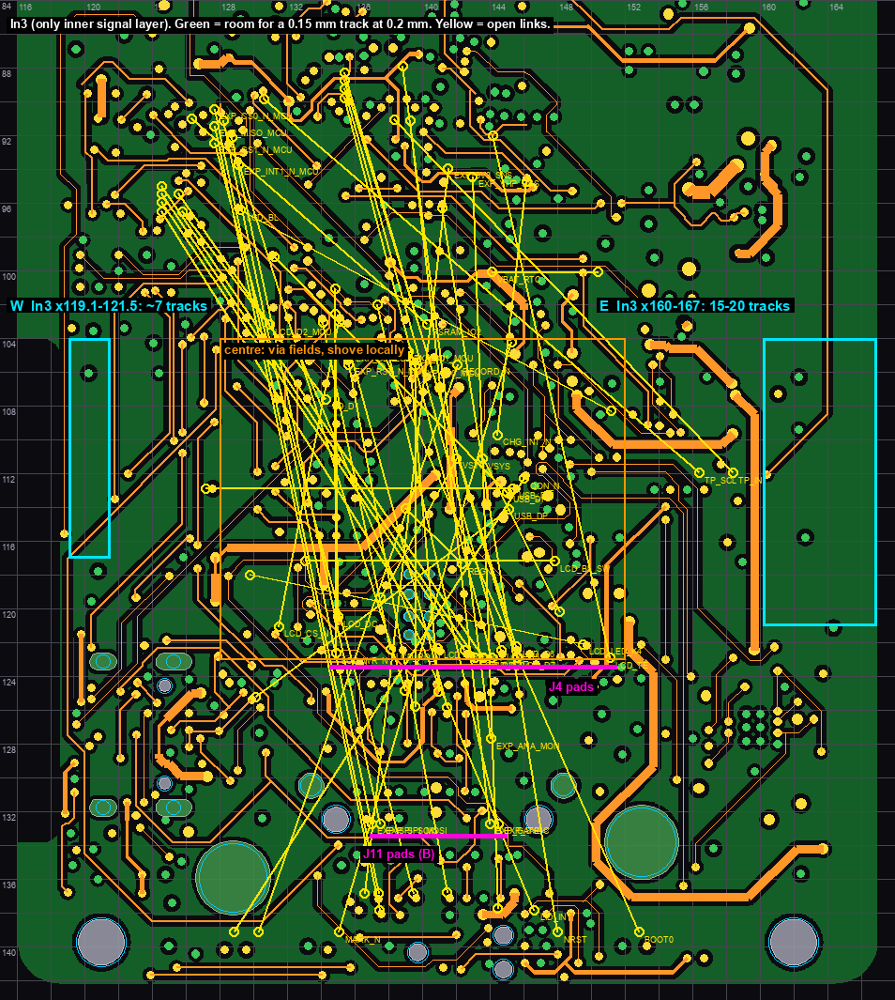
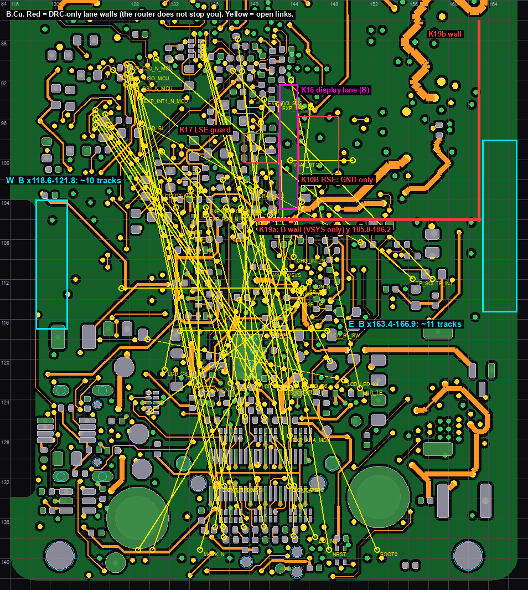

How to read the maps:
- Dark green is free centre-line space for a 0.15 mm track at 0.2 mm spacing on that layer.
- Orange shows that layer's tracks; yellow dots are vias and green dots are GND vias.
- Grey shapes are pads. Bright colours are highlighted nets.
- Yellow lines are the open links, labelled with the net name.
- The grid labels are board millimetres, the same coordinates as in KiCad.

## 2. Set-up (once)

1. **Open the project and keep a baseline.** Open `RFVD_SENSOR_BOARD.kicad_pro` in KiCad 10 from this folder. The `.kicad_dru` next to it carries all the custom rules. Save a copy of the board before you start; earlier states are in `backups/`.
2. **Add pre-defined sizes** in Board Setup ▸ Design Rules ▸ Pre-defined Sizes. The router's default size is per net: the net's class, or a custom rule's preferred (`opt`) value; here the two agree. Those are the comfortable sizes, wider than the minimums this board was routed at:
   - Harness_IO tracks: 0.25 mm default, 0.15 mm on the board.
   - Signal vias: 0.5/0.3 default, 0.45/0.20 on the board.
   - Power_Battery: 1.0 mm with 0.8/0.4 vias by default, 0.5–0.8 mm with 0.6/0.3 vias on the board.

   The pre-defined list is how you pick the dense sizes from the toolbar. It is empty, here and in the original project file. Add:
   - tracks: 0.10, 0.12, 0.15, 0.20, 0.30, 0.50 and 0.60 mm;
   - vias: **0.45/0.20** (signal, plated-over via-in-pad; 938 of the board's 1,031 vias are this size) and **0.60/0.30** (Power_Battery: the `via_battery` rule needs at least 0.6/0.3).
3. **Set up the router** in Route ▸ Interactive Router Settings: mode **Shove**, with shoving of vias on and DRC violations not allowed. Use 45° postures only (octilinear) with no 90° corners and no zig-zags; arcs are welcome on noise-sensitive lines.
4. **Set up the view.** Grid 0.05 mm. In1, In2 and In4 are solid GND planes and take no tracks (`v8_no_tracks_on_In*_plane`), so all inner signal routing is on In3.
5. **Check after every work package:**
   - refill the zones (B) and run DRC;
   - re-run the feasibility check (§7).

**Sizes per class (checked 2026-10-03 against the schematic, netlist and board).**
- **Where classes come from.** The schematic sheets carry no net-class flags. Each net gets its class from the 195 name patterns in the project file. The netlist that `kicad-cli sch export netlist` writes lists 305 nets, every one with a class.
- **Parity.** The board matches the netlist exactly: all 405 parts are placed, plus the H1–H4 holes, and all 1,220 pins sit on the same net. 0 mismatches.
- **What the class sets.** Each class's size is the router's default for its nets.
- **What the board uses.** Apart from the HighSpeed tracks, the board was routed at the rule minimums, not at the class sizes. Match the as-built column:

| Class (nets) | Class default: track / via | DRU minimum | As built (mm of track; via count) | Note |
|---|---|---|---|---|
| Default (110) | 0.12 / 0.5/0.3 | 0.10 | 0.10 mm: 927 of 989 mm; 0.45/0.20 vias: 169 of 170 | |
| HighSpeed_Digital (55) | 0.15 / 0.5/0.3 | 0.15 (max 0.20) | 0.15 mm; 0.45/0.20 vias: 88 of 88 | 0.2 mm to other signals outside U* courtyards |
| HighSpeed_Clock (14) | 0.15 / 0.5/0.3 | 0.15 (max 0.20) | 0.15 mm: 73 of 76 mm; 0.45/0.20 vias: 19 of 19 | 0.3 mm (3W) to other signals; LCD_WR_N and EXP_SPI_SCK are in this class |
| Harness_IO (58) | **0.25** / 0.5/0.3 | 0.15 | **0.15 mm: 803 of 806 mm**; 0.45/0.20 vias: 138 of 138 | |
| Power_Digital (7), e.g. VBAT_RTC | 0.5 / 0.6/0.3 | 0.30 (0.20 neck in IC and C3?? courtyards) | mostly 0.3 mm, 0.2 necks, some 0.5; vias 0.45/0.20: 52, 0.6/0.3: 8 | |
| Power_Battery (11), VSYS | **1.0 / 0.8/0.4** | 0.50 (0.20 neck in U*, C3?? and J11 courtyards) | 0.5 mm: 189 mm, 0.8: 66 mm, 0.2 necks; 0.6/0.3 vias: 46 of 53 | |
| USB_DP / USB_DM | (their class) | 0.15, max 0.20 (`v7_usb_fs_width`) | 0.15 mm | |
| REGN | (its class) | 0.15, opt 0.30 (`v9_regn_light`) | | |

The rule file's preferred (`opt`) values are the same numbers as the class defaults, so either way a Harness_IO net starts at 0.25 mm with a 0.5/0.3 via unless you pick a smaller size. Pre-defined sizes are how you pick it. The alternative is to change the class values in Board Setup ▸ Net Classes, together with the matching `opt` values in the rule file; that is a project decision.

## 3. Rules the router will not stop you at

All 43 rule areas on this board are plain named areas with **no keep-out flags**. Their limits are custom DRC
`disallow` rules, so the interactive router lets you draw through them and only DRC reports it. Run DRC after each
package. The ones in the routing area:

| Area | Layer | Where (mm) | What may go there |
|---|---|---|---|
| AFE_PARTITION | F, B (In1/In2) | the whole board north of y 95.6 | No HighSpeed / Harness_IO tracks or vias, except through the bridges BR1 (x 131.5–138.6, y 84.6–88.7) and BR2 (x 142–148.1, y 86–94.6), the K16 head, or inside the U8/U13 courtyards. Rule level: warning. **In3 under the partition is allowed with no vias in it** (project decision 1). |
| K16_DISP_LANE | B | x 143.05–144.9, y 92.5–105.0 | CHG_INT_N, LCD_TE(_MCU), LCD_RST(_MCU), TP_RST(_MCU), BUCK_SYNC(_MCU) and GND vias only. |
| K17_LSE_GUARD | B | x 139.5–143.0, y 97.4–100.4 | PC14, PC15 and GND only. |
| K10F_HSE_CELL / K10B_HSE_SHADOW | F / B | x 143.1–149.1, y 95.6–101.4 (K10B from x 145.0) | F: Y1-OUT, PH0, +3V3_D and GND. B: GND vias only. |
| K19a / K19b / K19c | B | y 105.8–106.2 for x 140.6–163.3; x 162.9–163.3 for y 67–106.2 | **VSYS only.** This is a B wall across the east half at y 106. Cross it on In3, or on B east of x 163.4. |
| K18_BR3_FEED | B | x 161.3–162.0, y 86–102.6 | +3V3_D (and GND vias). |
| K15_BR5_CHANNEL | B | x 121.5–124.5, y 64–84 | I2C_SCL, I2C_SDA and +3V3_D; no vias. |
| K11_* | F | where J11, H5 and H6 holes surface | GND only. |
| K7_H1..H4 | all | 6.5 mm circles around the M2.5 bosses | No vias. Non-GND copper stays at least 1.4 mm from the hole wall; vias and B-side courtyards stay 1.9 mm away. H5/H6: 0.5 mm. |
| K4, K9, K12, K13 | F / B | TFT fold loop; battery window (no B test pads or jumpers for y < 116); J10/J6 tails; U402 via field | Footprints only. Tracks and vias are fine. |

**EMC and other rules** (the user's hard requirement; most are DRU clearances the router does respect):
- **High-speed and clock spacing.** HighSpeed nets keep 0.2 mm from other signals, clocks 0.3 mm.
- **Analog spacing.** Keep 1.0 mm from HighSpeed / Harness_IO to Analog_Precision and Ref_Kelvin copper (outside U2, U8 and U13).
- **Edge distance.** HighSpeed, analog, RF and switch-node nets stay 1.0 mm from the board edge; other nets 0.5 mm.
- **In3 is off-limits** to RF, Analog_Precision and Ref_Kelvin nets (`v8_sensitive_nets_off_In3`).
- **Return vias.** Every HighSpeed / clock signal via needs a GND via within 1.0 mm (EMC rule R17): the reference plane changes between In1 and In2/In4. Place them as you route, or run `tools/retvia.py` on a saved copy afterwards and review its result.
- **Length matching.**
  - SD bus: skew ≤ 10 mm across CLK/CMD/D0–D3 (`skew_sdmmc`).
  - PSRAM QSPI: data lines within ±10 mm of each other.
  - Series resistors stay at their source pins (`len_source_stubs`, 3 mm).
- **No routing near the LSE crystal.** BUCK_SYNC must stay 3 mm from PC14/PC15 (sign-off rule; it passes now at 3.04 mm). Do not route anything new between them.

## 4. Order of work

| Step | Package | Links | Why in this order |
|---|---|---|---|
| WP1 | Power and charger | 5 | They need width and the shortest paths; one move (R19) also clears 57 mm of copper out of the band. |
| WP2 | USB | 3 | D+ has verified corridors **now**. Take them before the buses use up In3. |
| WP3 | U8 west / south-west corner | 3, plus 2 unlock moves | Opens RN201 for the display bus and settles the PSRAM / SD lengths. |
| — | **Decision: display bus** | | 8080 kept (D13). 4-wire SPI rejected: see the note before WP4. |
| WP4 | Display (J4) | 16 | The largest In3 consumer. |
| WP5 | Expansion (J11) | 15 | Uses the west corridor and the J11 approach. |
| WP6 | Buttons, SWD, lid, touch | 8 | Slow signals: they take the long free routes along the east side. |
| WP7 | Finish | | Return vias, clean-up, DRC to 0, outputs, copy back. |

## 5. Verified unlock moves

Each was tested on a scratch copy and re-checked with the feasibility tool. Each was tested alone.

| Move | Effect (measured) |
|---|---|
| **R19 to (149.00, 113.90), rot 0, B** (1k REGN → charge LED; its rule allows anywhere in series with D3, ≤ 40 mm). Delete the old CHG_LED_A copper (38 items: 57 mm and 6 vias that wander through the band). | The R19 REGN pad lands on existing REGN copper: **REGN closes with no new track**. CHG_LED_A becomes one open link, R19.2 (149.51, 113.90) → D3.2 (156.24, 136.84), with a legal path **B > In3 > F (2 vias)** down the free east side. The open count stays the same; the band gains the space. |
| **R60 to (121.30, 95.10), rot 180, F** (PSRAM IO0 series resistor). The rotation turns its MCU pad toward U8, about 3.9 mm from U8.58 (budget 5 mm). Then lift EXP_INT0_N_MCU's F run beside RN201: x 122.3–125.7, y 93.2–99.9, 10 items. This net detours 64 mm today for 34 mm direct. | RN201.5–8 (LCD_D0–D3, connector side) go from 0.7–1.6 mm reach to **14–15 mm**. The move leaves two short re-joins, both with a **direct F path**: PSRAM_IO0 R60.2 → R61.1 (1.7 mm) and EXP_INT0_N_MCU (5.9 mm). PSRAM_IO0_MCU stays connected. |
| C908 (100 pF, **DNP**, TP_INT shunt) removed from under RN202 | RN202.8 (LCD_D4) reach goes from 3.5 to **43.5 mm**. Its two legal alternative spots, (135.90, 91.30) and (136.00, 92.30) rot 90, do *not* help (4.0 mm). Dropping the DNP footprint is a team decision. |
| RN203: lift the LCD_CS_N / LCD_RD_N escape stubs and vias (vias at (135.148, 102.791) and (134.098, 102.841)) and the +3V3_D B segment (133.977–135.227, 100.393) | All four RN203 LCD pads get 8–9 mm reach. Lay out the four escapes together (see WP4). |

## 6. Work packages

### WP1 — Power and charger (5 links)

| Net | End A (closest point) | End B (closest point) | Gap mm | Class, width | Today | Boxed-in end (reach) |
|---|---|---|---|---|---|---|
| VSYS | C27.1 C28.1 C30.1 ... (142.05, 111.13) | R405.1 (137.53, 119.35) | 9.4 | Power_Battery 0.5 | **blocked** | B (1.4 mm) |
| VSYS | C27.1 C28.1 C30.1 ... (143.57, 111.14) | TP9.1 (148.11, 120.18) | 10.1 | Power_Battery 0.5 | **blocked** | - |
| REGN | C312.1 R306.1 R308.1 ... (142.37, 117.38) | R19.1 (139.00, 114.11) | 4.7 | REGN 0.15 / 0.3 | **blocked** → closed by the R19 move | - |
| VBAT_RTC | C603.1 U8.6 (144.12, 100.09) | C327.1 U303.5 (150.39, 100.09) | 6.3 | Power_Digital 0.3 | **blocked** | - |
| CHG_INT_N | U301.21 (144.45, 109.74) | C907.1 R311.2 U8.22 (146.18, 94.77) | 15.1 | Harness_IO 0.15 | **blocked** | A (1.0 mm) |

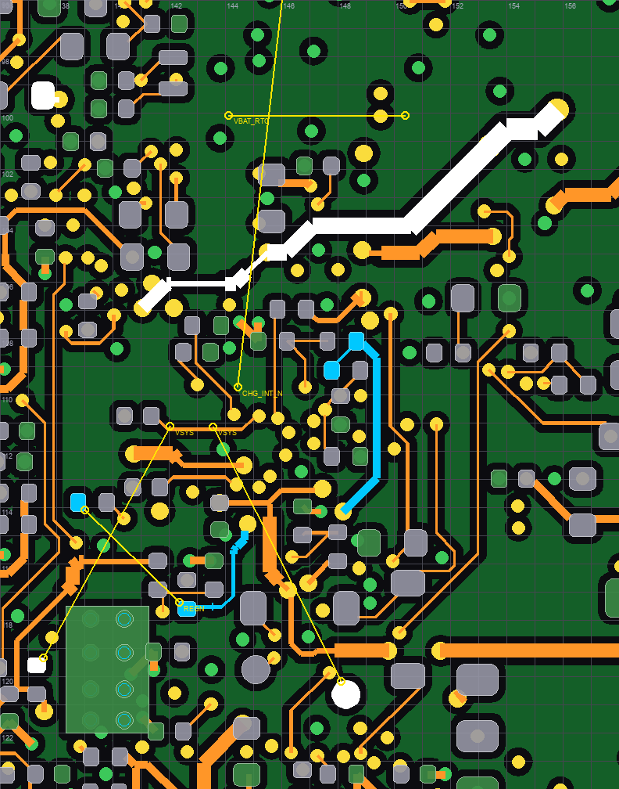
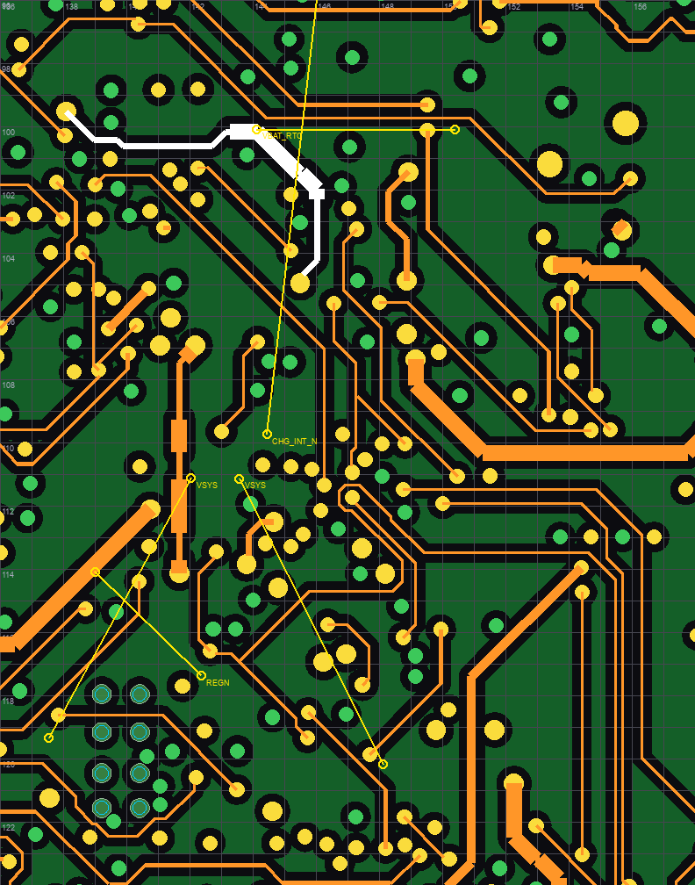
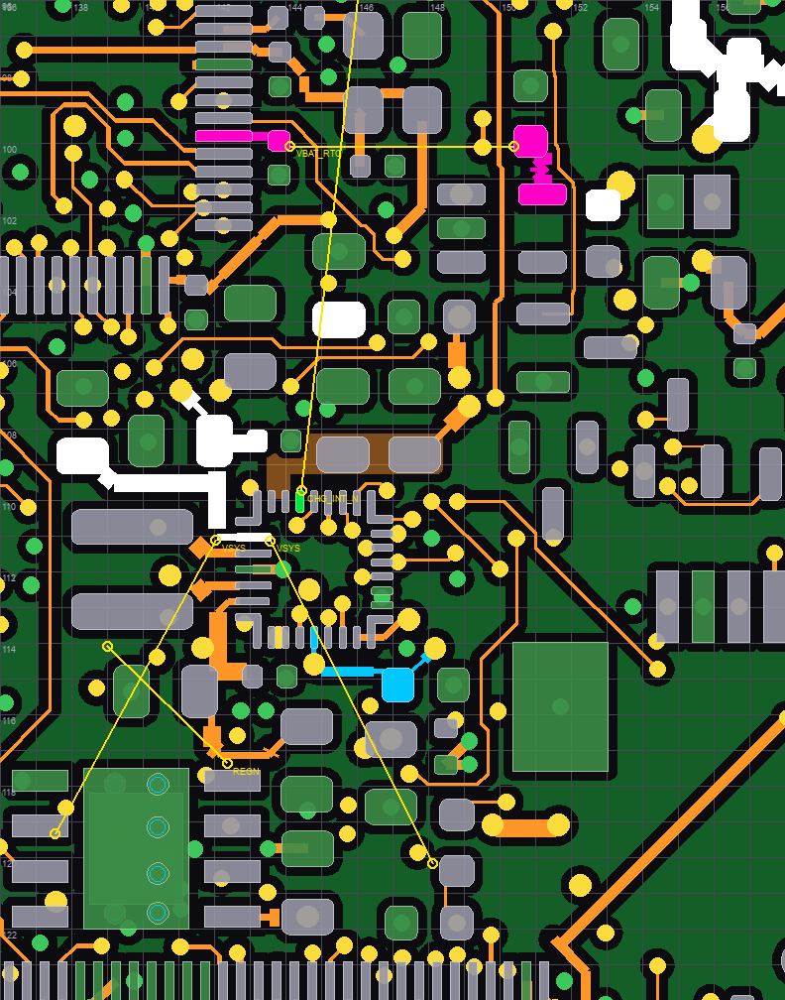

1. **REGN.** Do the R19 move from §5, then route CHG_LED_A from R19.2 to D3.2 down the east side (In3, about 24 mm). It is a slow LED current.
2. **VBAT_RTC** (6.3 mm, 0.3 mm wide; both ends reach only 4–5 mm). The straight line crosses the HSE cell, where K10F bans it on F and K10B on B. On In3 three things close it:
   - VSYS at (144.1–145.4, 100.2–101.5);
   - the TP_SDA F hop at x 149.53;
   - the EXP_VHP_EN segment at y 99.72.

   Shove the TP_SDA hop and the EXP_VHP_EN segment around U303. Then run VBAT_RTC on In3 at about y 100.3, with vias outside the K10F/K10B outlines.
3. **CHG_INT_N.** U301.21 is boxed in:
   - C318.2 (GND) and C319.1 (CHG_BAT) are only 0.44 mm apart;
   - the PROG track and via at (144.33, 110.72) sit next to it.

   The B lane K16 (x 143.05–144.9) is reserved for this net and is empty. Proceed in this order:
   1. Move the I2C_SCL In3 diagonal (x − y = 39.24) about 0.6 mm south-west.
   2. Escape U301.21 to a via and run In3 to a via at about (143.35, 104.9).
   3. Go up the K16 lane to C907/R311.

   At the top, finish on B only: any via there would sit within 1 mm of +3V0_REF (C56/C59).
4. **VSYS → R405.** R405 is the fitted 0 Ω EXP_VHP source select that feeds U402 IN; its rule says to size the copper for 2× the load current. R405.1 is boxed in (1.4 mm). Plan a path of at least 0.5 mm (In3, or B west of L301 at x 136–138) from the VSYS vias at C313/C314 (about 142, 111) to R405.1. Use two 0.60/0.30 vias per layer change and shove the signal tracks around R405 first. Power path: no neck-downs outside U*/C3?? courtyards.
5. **VSYS → TP9** (test pad). TP9 must stay on B, and K9_BATT_WINDOW forbids B test pads north of y 116. VSYS copper ends at about y 111, and no legal TP9 spot touches existing VSYS copper (checked). It therefore needs a real route at the 0.5 mm class minimum, which is blocked today. Two options for the team:
   - shove a 0.5 mm path from U301.25 / C314 south to TP9;
   - add a scoped DRU exception for a thin probe stub to TP9.

### WP2 — USB (3 links)

| Net | End A (closest point) | End B (closest point) | Gap mm | Class, width | Today | Boxed-in end (reach) |
|---|---|---|---|---|---|---|
| USB_DP | U301.6 (145.12, 114.13) | J10.A6 J10.B6 TP305.1 ... (130.15, 125.26) | 18.7 | USB 0.15 | **blocked** | - |
| USB_DP | U301.6 (145.04, 113.13) | U8.71 (131.28, 99.22) | 19.6 | USB 0.15 | **path now: In3 only, no new via** | - |
| USB_DM | U301.7 (145.38, 112.89) | J10.A7 J10.B7 TP306.1 ... (127.19, 112.89) | 18.2 | USB 0.15 | **blocked** | - |

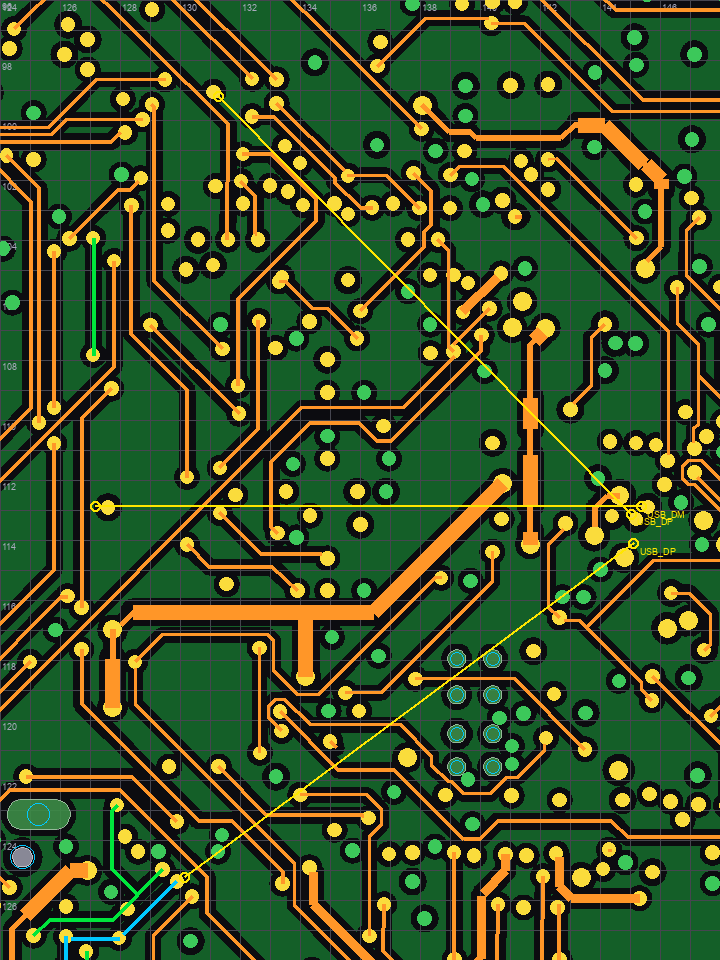
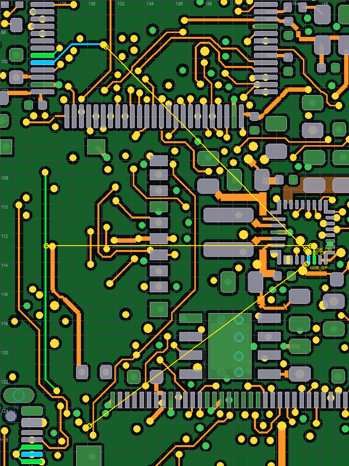

USB_DP today has three separate pieces: J10/U304/TP305, the U8.71 escape, and U301.6. The U8.71 escape ends in a via under U8 at (131.12, 99.06).
1. **Main path first: J10/U304 → U8.71.** A legal path exists now, **In3 plus 1 via**. This was checked as an extra link: the ratsnest pairs the pieces differently. Keep D+ as close to D− as the shove allows; USB_DM runs J10 → U304 → U8.70 along x ≈ 127.2.
2. **BC1.2 branch to the charger: U8.71 escape → U301.6.** There is a **direct In3 corridor today**, from the via at (131.12, 99.06) to U301.6's via at (145.20, 113.29), with no new via needed. Steps 1 and 2 were each checked alone; route step 1 first.
3. **USB_DM → U301.7.** Blocked: U301.7 reaches 8.4 mm, then a barrier. Shove the In3 tracks between the DM run (x 127.19) and U301 so that the D− branch runs beside the D+ branch.

Keep both lines 0.15 mm wide and add a GND via at each layer change. At 12 Mb/s the branch lengths do not matter; the loop area between D+ and D− does (EMC).

### WP3 — U8 west / south-west corner (3 links and the RN201 unlock)

| Net | End A (closest point) | End B (closest point) | Gap mm | Class, width | Today | Boxed-in end (reach) |
|---|---|---|---|---|---|---|
| SD_D1 | D9.1 J3.8 R37.2 (134.31, 107.64) | R35.2 (125.79, 96.51) | 14.0 | HighSpeed_Digital 0.15 | **blocked** | - |
| PSRAM_IO2 | R64.2 (140.28, 103.20) | R65.1 (126.36, 91.05) | 18.5 | HighSpeed_Digital 0.15 | **path now: In3 > B (1 via)** | - |
| LCD_D2_MCU | U8.81 (130.97, 103.21) | RN201.3 (125.57, 95.47) | 9.4 | HighSpeed_Digital 0.15 | **blocked** | B (1.0 mm) |

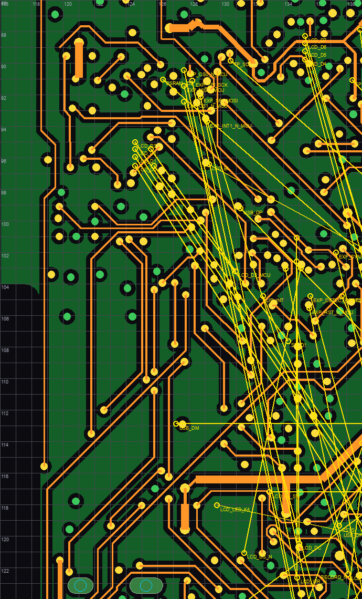
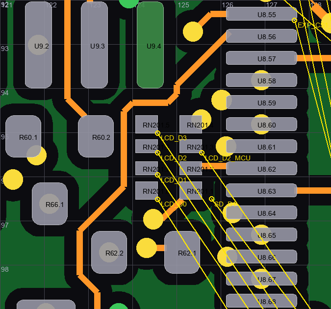

1. **RN201 unlock.** Do the R60 move and lift and re-join EXP_INT0_N_MCU (§5). Do this *before* PSRAM length matching, because R60 is in the PSRAM IO0 path.
2. **PSRAM_IO2.** Draw it now (In3 + 1 via). Keep its length within ±10 mm of IO0, IO1 and IO3.
3. **SD_D1.** Both ends reach about 8 mm; the barrier is the U8 south-west fan-out (the SD_D0/SD_D2/SD_CLK escapes).
   - R35 has **no copper-legal spot next to R34** (checked: the only legal spots are its current one and spots 4–5 mm away), so keep it where it is and re-fan the SD escapes around it.
   - Then match SD_D1 to CLK/CMD/D0/D2/D3 within 10 mm. That clears the 2 `skew_sdmmc` DRC errors.
4. **LCD_D2_MCU** (MCU side of RN201). RN201.3 is boxed in by:
   - its neighbour pads RN201.2 and RN201.4;
   - LCD_D3_MCU's via at (125.561, 94.705);
   - LCD_D1_MCU's track at y 95.77.

   Re-fan the four MCU-side escapes of RN201 (pads 1–4) together.

### Display bus: 8080 kept, SPI rejected

The display uses the 8-bit 8080 bus: D0–D7 plus CS/DC/WR, 11 long lines through the most crowded band. **Rejected (lead decision D13, critique P1-31): the 8080 bus stays.** For the record, 4-wire SPI on this panel would use J4.9 SDA (GND today), J4.11 SCL, J4.12 D/CX and J4.10 CSX with IM = 0/1/1. It would also need an MCU re-pin (SPI1 on PB3/PD7, which loses SWO), a rev-2 or later panel, and about 81 ms per full frame at 15 MHz. The earlier note in this guide (SCL on WR, SDA on D0) named the wrong pins. Checkpoint 2a made the bus write-only (RDX tied to +3V3_UI, so LCD_RD_N is gone) and put the IM straps in copper (R200-R202 deleted).

### WP4 — Display bus to J4 (16 links)

| Net | End A (closest point) | End B (closest point) | Gap mm | Class, width | Today | Boxed-in end (reach) |
|---|---|---|---|---|---|---|
| LCD_D0 | J4.22 (140.93, 122.34) | RN201.8 (124.57, 96.52) | 30.6 | HighSpeed_Digital 0.15 | **blocked** | B (1.6 mm) |
| LCD_D1 | J4.23 (142.53, 122.49) | RN201.7 (124.57, 95.97) | 32.0 | HighSpeed_Digital 0.15 | **blocked** | B (0.7 mm) |
| LCD_D2 | J4.24 (143.13, 122.92) | RN201.6 (124.57, 95.47) | 33.1 | HighSpeed_Digital 0.15 | **blocked** | B (0.7 mm) |
| LCD_D3 | J4.25 (143.63, 122.92) | RN201.5 (124.57, 95.02) | 33.8 | HighSpeed_Digital 0.15 | **blocked** | B (0.7 mm) |
| LCD_D4 | J4.26 (144.13, 122.92) | RN202.8 (135.40, 89.79) | 34.3 | HighSpeed_Digital 0.15 | **blocked** | - |
| LCD_D5 | J4.27 (144.69, 122.46) | RN202.7 (135.40, 89.24) | 34.5 | HighSpeed_Digital 0.15 | **blocked** | - |
| LCD_D6 | J4.28 (145.59, 122.26) | RN202.6 (135.40, 88.74) | 35.0 | HighSpeed_Digital 0.15 | **blocked** | - |
| LCD_D7 | J4.29 (145.63, 122.92) | RN202.5 (135.40, 88.29) | 36.1 | HighSpeed_Digital 0.15 | **blocked** | B (0.8 mm) |
| LCD_CS_N | C203.1 J4.10 R50.2 (131.51, 121.08) | RN203.6 (135.10, 103.01) | 18.4 | Harness_IO 0.15 | path now: F > In3 > F (2 vias) | - |
| LCD_DC | J4.11 (135.00, 120.50) | RN203.5 (134.85, 101.09) | 19.4 | Harness_IO 0.15 | path now: F > In3 > B > In3 > B (4 vias) | - |
| LCD_WR_N | C202.1 J4.12 R203.2 (134.89, 122.65) | RN203.8 (134.85, 102.59) | 20.1 | HighSpeed_Clock 0.15 | **blocked** | - |
| LCD_RD_N | C204.1 J4.13 R204.2 (138.13, 122.42) | RN203.7 (134.14, 103.06) | 19.8 | HighSpeed_Digital 0.15 | **blocked** | - |
| LCD_TE | J4.40 (151.13, 122.92) | R206.2 (144.22, 92.05) | 31.6 | Harness_IO 0.15 | **blocked** | - |
| LCD_BL | U8.63 (129.27, 96.42) | R211.1 (151.17, 108.28) | 24.9 | Harness_IO 0.15 | path now: In3 > F > B > F > B (4 vias) | - |
| LCD_LED_K4 | J4.37 (149.53, 122.13) | D204.2 (129.79, 118.06) | 20.2 | Harness_IO 0.15 | path now: F > B > F > B (3 vias) | - |
| LCD_BL_SW | D201.1 D202.1 Q203.3 (147.85, 117.22) | D203.1 D204.1 (133.10, 117.22) | 14.8 | Default 0.1 | path now: B > In3 > F > B (3 vias) | - |

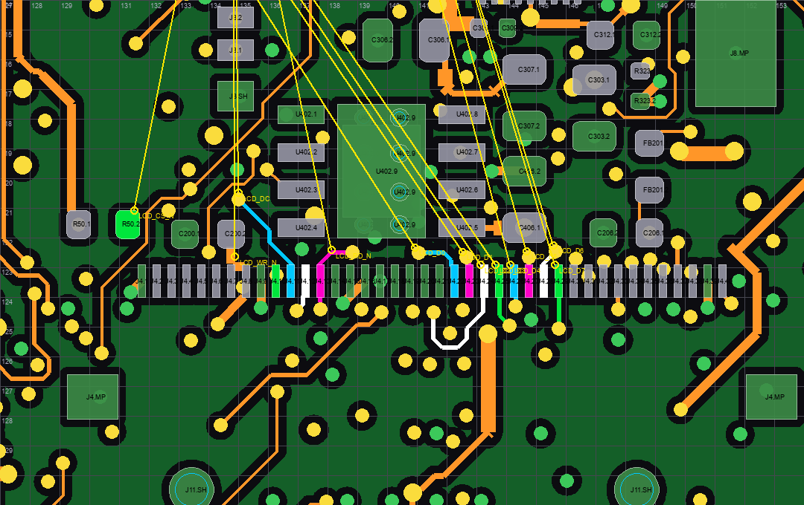
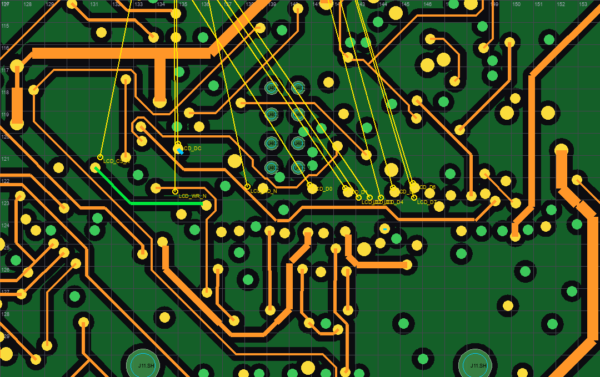
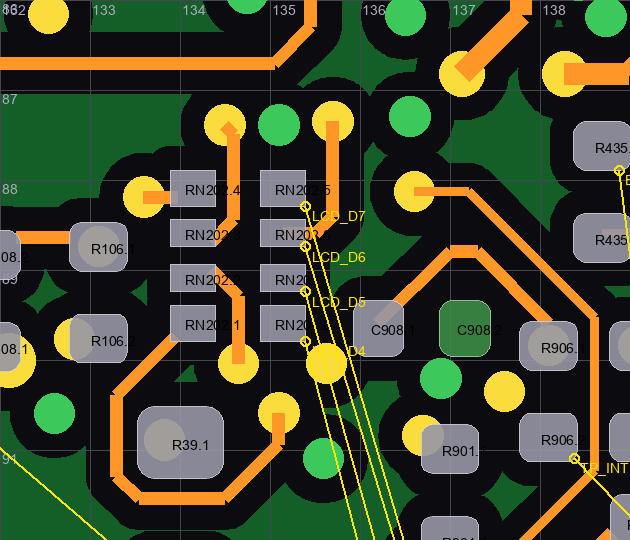
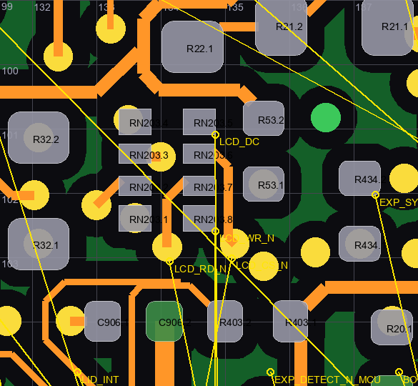

The series arrays sit at U8 on purpose (source termination, `len_source_stubs`), so keep them there and fix their escapes:
- **RN201** (F, west of U8 pins 60–63; D0–D3): done in WP3. Exit RN201.5–8 west to staggered vias at 0.65 mm or more apart. Those 4 nets are HighSpeed, so 0.2 mm spacing applies.
- **RN202** (B, under U8's north pins; D4–D7): the D6 escape blocks D7. It runs east from RN202.6 to (135.50, 88.60), then north along x 135.70 to y 87.35, with a GND via at (135.098, 87.391). C908 (DNP) blocks D4 (§5). Re-plan all four escapes together.
- **RN203** (B, under U8's south half; CS/DC/WR/RD): CS_N and RD_N took the two escape vias south of the array, which boxes in WR_N; DC is boxed in by the +3V3_D B segment at y 100.39 (§5). Re-lay the four as one group. WR_N is a **clock (0.3 mm to other signals)**, so put it on the outside of the group or next to GND.
- **J4 via field.** Today D0, D1, D5 and D6 have vias just north of the pad row: (141.05, 122.52), (142.65, 122.67), (144.75, 122.67) and (145.65, 122.47). Legal via sites for the bare pads, checked:
  - D3 (J4.25): (144.45, 125.27), under the connector body.
  - D7 (J4.29): (145.75, 124.47), (146.20, 124.92) or (145.30, 125.17).
  - **D2 (J4.24) and D4 (J4.26): none within 2.5 mm today.** Re-space the 8 data vias as one field: one row north of the pads (y ≈ 122.5) and one under the body (y ≈ 124.5–125.3), alternating pins. R411's GND via (144.85, 124.75) is already under the body.
- **Paths for D0–D7 (plan, not verified as a whole).** Even after the unlocks the eight data lines stay blocked in the middle of the band; that part is shoving work.
  - D4–D7 come from RN202 under U8: candidates are In3 under U8 and then south through the centre via fields (In3 x 134–139 has room for 3–11 tracks at each latitude from y 105 to 117).
  - D0–D3 come from RN201: candidates are the west corridor, then east under J3's south edge. Crossing x = 128 between y 120 and 122.3 there is room for about 7 tracks on F, 2 on B and 1–2 on In3 today.
- **LCD_TE.** K16 (B, x 143.05–144.9) is its lane. Legal via sites at J4.40: (151.30, 124.62) or (150.40, 122.57).
- **LCD_BL, LCD_LED_K4, LCD_BL_SW.** Paths exist now; draw them after the bus so they do not take its space.

### WP5 — Expansion to J11 (15 links)

| Net | End A (closest point) | End B (closest point) | Gap mm | Class, width | Today | Boxed-in end (reach) |
|---|---|---|---|---|---|---|
| EXP_CS0_N_MCU | U8.51 (127.68, 90.46) | R425.1 (137.40, 136.83) | 47.4 | HighSpeed_Digital 0.15 | **blocked** | - |
| EXP_CS1_N_MCU | U8.55 (127.68, 92.46) | R427.1 (139.45, 136.83) | 45.9 | HighSpeed_Digital 0.15 | **blocked** | - |
| EXP_MISO_MCU | U8.53 (127.68, 91.46) | R423.1 (137.47, 137.83) | 47.4 | HighSpeed_Digital 0.15 | **blocked** | - |
| EXP_INT1_N_MCU | U8.57 (129.14, 93.73) | R428.1 (139.00, 124.83) | 32.6 | Harness_IO 0.15 | path now (5 vias) | - |
| EXP_RST_N_MCU | U8.91 (135.64, 105.56) | R431.1 (141.50, 136.82) | 31.8 | Harness_IO 0.15 | path now: F > B > In3 > F (3 vias) | - |
| EXP_DETECT_N_MCU | U8.90 (135.70, 104.79) | R432.1 (141.45, 125.83) | 21.8 | Harness_IO 0.15 | **blocked** | - |
| EXP_IO0_MCU | U8.98 (139.60, 105.67) | R429.1 (139.60, 125.82) | 20.2 | Harness_IO 0.15 | path now: B > In3 > F > B (3 vias) | - |
| EXP_IO1_MCU | U8.97 (139.17, 104.79) | R430.1 (140.95, 124.89) | 20.2 | Harness_IO 0.15 | path now (4 vias) | - |
| EXP_SPI_SCK | D401.1 J11.5 (137.00, 132.74) | R419.2 (128.23, 91.13) | 42.5 | HighSpeed_Clock 0.15 | **blocked** | - |
| EXP_SPI_MOSI | D401.2 J11.7 (137.50, 132.74) | R421.2 (128.74, 92.14) | 41.5 | HighSpeed_Digital 0.15 | **blocked** | - |
| EXP_GATE | D403.1 J11.33 (144.00, 132.74) | R433.2 (139.28, 91.13) | 41.9 | Harness_IO 0.15 | path now (6 vias, long) | - |
| EXP_SYNC | D403.2 J11.35 R440.2 (144.50, 132.74) | R434.2 (137.33, 102.03) | 31.5 | Harness_IO 0.15 | path now (4 vias) | - |
| EXP_ANA_MON | D406.5 J11.34 (144.08, 127.71) | R435.2 (138.88, 87.89) | 40.2 | Harness_IO 0.15 | **blocked** | B (0.0 mm) |
| EXP_3V3_SNS | C408.1 R415.1 U8.18 (141.55, 93.97) | R414.2 (136.60, 136.83) | 43.1 | Default 0.1 | path now: F > B (1 via) | - |
| EXP_VHP_SNS | C407.1 R413.1 U8.17 (143.00, 94.47) | R412.2 (144.48, 137.78) | 43.3 | Default 0.1 | path now: F > B (1 via) | - |

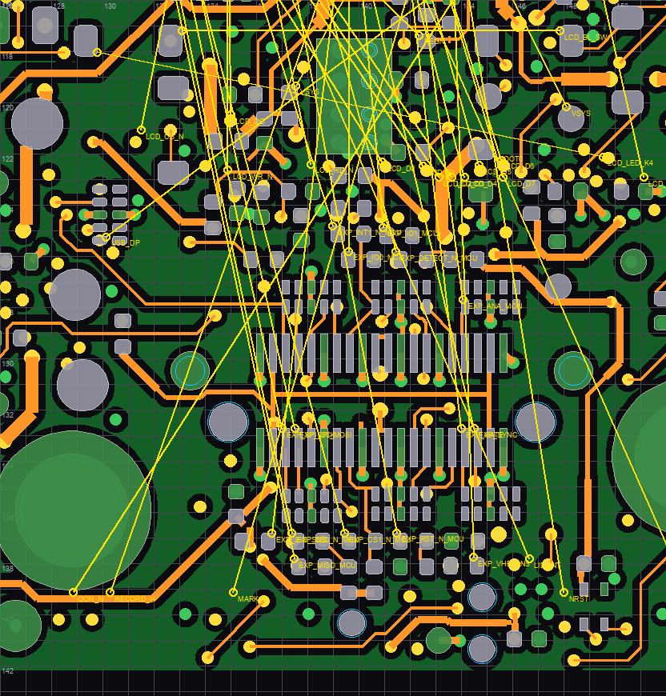
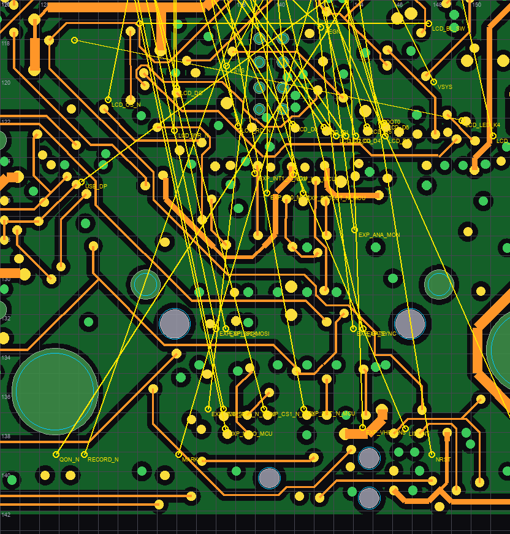

- **The west-pin SPI group** has five lines:
  - EXP_CS0_N, CS1_N and MISO from U8.51/53/55 (x 126.9, y 90.3–92.5);
  - EXP_SPI_SCK and MOSI from R419/R421, under U8's west pins.

  Route them as one group. Leave U8's west side on In3, go down the **west corridor** (In3 x 119.1–121.5 has about 7 tracks; B x 118.6–121.8 about 10), then cross east to J11 (x 137–145, y 124–138). This is a plan; the group is blocked today. SCK is a **clock**: give it 0.3 mm, keep it on the outside of the group, and give it GND return vias. The R419.2 escape via at (128.09, 90.67) has EXP_TMR1 B tracks 0.46–0.54 mm away (x 127.50 and the 128.3–128.7 jog), so plan that corner first.
- **EXP_ANA_MON.** R435.2 (138.70, 87.62) lies **inside AFE_PARTITION, 0.1 mm east of the BR1 bridge** (x ≤ 138.6). Any Harness_IO track leaving it trips `v3_afe_partition_aggressors`; that rule is at warning level and says "review each hit". No copper-legal shift of R435 exists (checked). Team options:
  - accept and document the warning for the first mm;
  - or extend BR1 east by about 0.3 mm (a rule-area edit).
- **EXP_DETECT_N.** The U8.90 escape (the south pin row) is blocked between the U8.90–92 fan-out vias and J3's ESD field. Lay it out together with EXP_RST_N (U8.91), which has a path.
- **Monitors.** EXP_3V3_SNS and EXP_VHP_SNS each have an F path with one via. They are slow (Default class), so a long route is fine; keep them clear of the analog partition on F/B.
- **Draw order.** Draw the 7 links that have paths after the SPI group, so they do not take the corridor.

### WP6 — Buttons, SWD, lid and touch (8 links)

| Net | End A (closest point) | End B (closest point) | Gap mm | Class, width | Today | Boxed-in end (reach) |
|---|---|---|---|---|---|---|
| BOOT0 | SW4.1 (152.85, 139.14) | R20.1 U8.94 (137.70, 104.79) | 37.5 | Harness_IO 0.15 | path now: F > In3 > B (2 vias) | - |
| NRST | J6.3 SW3.1 (148.03, 139.14) | C46.1 R18.2 U8.14 (141.22, 96.28) | 43.4 | Harness_IO 0.15 | path now (4 vias) | - |
| MARK_N | SW2.1 (135.10, 139.14) | C70.1 R49.2 U8.3 (145.31, 104.24) | 36.4 | Default 0.1 | path now (4 vias) | - |
| RECORD_N | C67.1 R44.2 U8.2 (142.07, 105.58) | SW1.1 (130.28, 139.14) | 35.6 | Default 0.1 | path now (3 vias) | - |
| QON_N | U301.12 (146.03, 112.33) | SW5.2 (128.85, 139.14) | 31.8 | Default 0.1 | path now: F > In3 > F (2 vias) | - |
| LID_INT | U702.5 (146.66, 137.83) | C906.1 R701.1 U8.84 (132.70, 104.79) | 35.9 | Harness_IO 0.15 | **blocked** | - |
| TP_INT | J8.5 R208.2 (158.40, 111.99) | R906.2 (138.38, 91.09) | 28.9 | Harness_IO 0.15 | path now (3 vias) | - |
| TP_SCL | J8.3 R45.2 (156.40, 111.99) | U8.46 (130.66, 89.84) | 34.0 | Harness_IO 0.15 | path now (3 vias) | - |

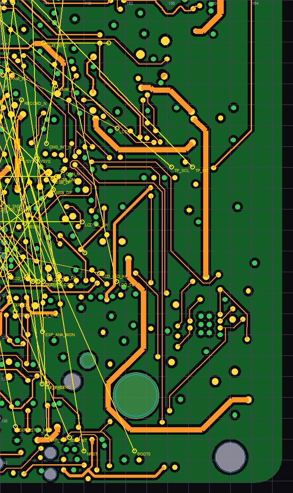
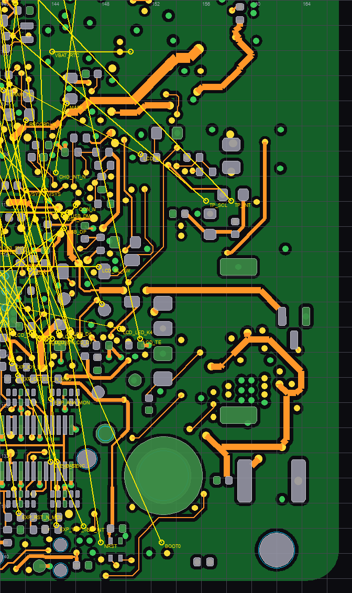
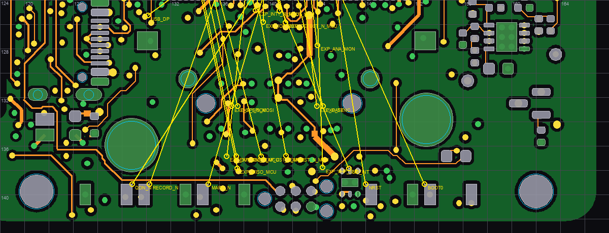

- **Buttons and NRST.** Slow, debounced lines. Use the **east side**, where In3 x 150–166 and B east of x 163.4 are largely free.
  - Cross y 106 on In3 (K19a blocks B).
  - Go along the bottom on F or B to the switches at y 139–140 (SW1 129.8, SW5 128.4, SW2 134.7, SW3 148.5, SW4 153.3).
  - Free bottom lanes, measured with the 1.4 mm mounting-hole keep-away around H3/H4:
    - F y 136.5 (x 131.2–144.4), 1 track;
    - F y 141.3–142.0 (x 149.6–159.7), 2 tracks;
    - In3 y 138.9–139.5 (x 123.8–134.7), 2 tracks;
    - B y 136.3–136.9 (x 156.5–166.9), 2 tracks.

    Elsewhere along the bottom, use short octilinear jogs between the J11 resistor field and the switch pads.
- **LID_INT** is blocked between U8.84 (south pin row, x 132.7) and U702.5. Treat it like EXP_DETECT_N: it needs the U8 south-row fan-out around x 132–136 re-spaced.
- **TP_INT / TP_SCL** run from J8 (x 156–159, y 112–113) to U8's north side.
  - They are Harness_IO, so on F/B they must stay out of AFE_PARTITION (north of y 95.6) except through BR1/BR2 or inside U8's courtyard.
  - On In3 under the partition they are allowed, but with no via inside it.
  - TP_SCL's U8 end is already an In3 stub at (130.60, 89.79).

### WP7 — Finish

1. **Return vias.** Add a GND via within 1.0 mm of every new HighSpeed / clock via (R17), by hand or with `tools/retvia.py` on a saved copy, then review.
2. **Clean up.** Delete the unused escape stubs and vias (`via_dangling` / `track_dangling` warnings).
3. **Clear the last DRC errors.**
   - C106/C24 courtyard overlap: no copper-legal pose within 0.5 mm was found for either part, so nudge one with push-and-shove of its neighbours.
   - `skew_sdmmc`: clears after SD_D1 is routed and matched (WP3).
4. **Sign off.** Refill zones and run DRC with the project rules: target **0 errors**. Then run `tools/drcsum.py` for the #SIGNOFF EMC rules, and `tools/place/metrics.py OLD NEW` to confirm no net got worse.
5. **Regenerate the outputs** with `tools/make_outputs.py` (DRC report, unrouted map, positions, layer PDF, renders).
6. **Copy back** into `RFVD_SENSOR_BOARD_GITHUB` (README "What to do next", step 5). Generate Gerbers and drill files only after DRC is clean.

## 7. Re-checking between packages

All tools run with KiCad's python (`"C:/Program Files/KiCad/10.0/bin/python.exe"`; under Git-Bash set
`MSYS_NO_PATHCONV=1`). They are read-only on the board and must not run on a file KiCad has open with unsaved changes.

```
tools/unrouted_map.py RFVD_SENSOR_BOARD.kicad_pcb outputs/RFVD_unrouted     # fresh open-link list + map
tools/feasible.py RFVD_SENSOR_BOARD.kicad_pcb outputs/RFVD_unrouted.csv check.json --band
tools/zoom.py RFVD_SENSOR_BOARD.kicad_pcb out.png X0 Y0 X1 Y1 40 --layer In3.Cu --grid --free 0.15,0.2 --open outputs/RFVD_unrouted.csv
tools/cutcap.py RFVD_SENSOR_BOARD.kicad_pcb 0.15 0.2 h:111:116:167          # tracks that fit across a cut
```

`feasible.py` prints, for each open link, "DIRECT layer", "route" with the layer sequence and representative via
spots, or "BLOCKED", plus the reach of both ends. The representative via spots are arbitrary points where a via
fits, not recommendations; place vias where the shove router finds room.

## 8. Where this comes from

The data and tools behind this guide:
- `tools/feasible.py`, `tools/cutcap.py`, and `tools/zoom.py --open` (new on 2026-10-03).
- The what-if boards for the unlock moves (scratch copies; the moves are listed in §5 and can be repeated with `tools/place/pen.py`).
- The blocker notes in `LAYOUT_STATUS.md` ("Blockers found while hand-routing" and "Band re-layout study").
- The DRU (`RFVD_SENSOR_BOARD.kicad_dru`).

Placement checks used `tools/query.py free --copper`, which finds legal spots by courtyards, keep-outs, B-side height windows and pad-to-copper class clearances.
